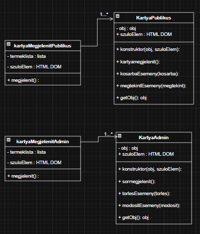

# **Webshop koncepció**
Egy modern, reszponzív, kliensoldali webshop prototípus kitalált termékekkel, amelynél a fő fókusz a tiszta OOP struktúra és az UML tervezés volt. A publikus webshop oldalon a termékek kártyaként megjelenítve, képpel, névvel, leírással, működő kosár, megtekintés funciókkal. Az admin webshop oldalon a termékek táblázatban megjelenítve, ugyanúgy névvel, leírással, képpel, működő módosítás, törlés funkciókkal.
## Feladatkiosztás
* Gubek Vera: admin webshop
* Bernáth Milán: publikus webshop
## Felhasznált technológiák
* **Frontend:** JavaScript, HTML5, CSS3
* **Adatkezelés:** Kliensoldali szimulált adatbázis (`termekLista.js`)
* **Tervezés:** UML Osztálydiagram
## Fejlesztés alatt álló funkciók (Roadmap)
* A kosár funkció elkészítése.
## UML ábra

